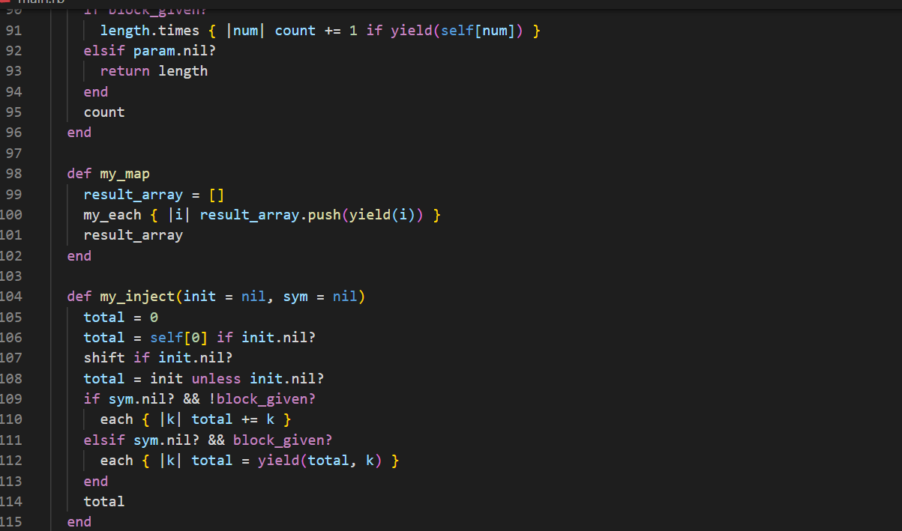

# Recreation of Enumerable Methods

> 

## Built With

- Ruby
- VSCode

To get a local copy up and running follow these simple example steps.

### Prerequisites
    - You need to have ***Ruby*** installed on your machine ([Check this out](https://www.ruby-lang.org/en/documentation/installation/) for instructions on installing ruby)

### Usage
    To run the code go to the local folder where you have the *Ruby file* and run in the terminal `$ ruby file.rb` being 'file' the one you want to run

## Author

👤 **Dannison Arias**

- Github: [@dannisonarias](https://github.com/dannisonarias)
- Twitter: [@AriasDannison](https://twitter.com/AriasDannison)
- Linkedin: [Dannison Arias](https://www.linkedin.com/in/dannison-arias-777919190/)

## 🤝 Contributing

Contributions, issues and feature requests are welcome!

Feel free to check the [issues page](issues/).

## Show your support

Give a ⭐️ if you like this project!

## Acknowledgments

- Microverse
- The Odin Project
- The Corgis

## 📝 License

This project is [MIT](./license.md) licensed.